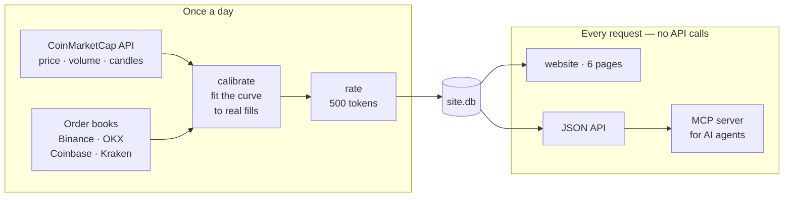
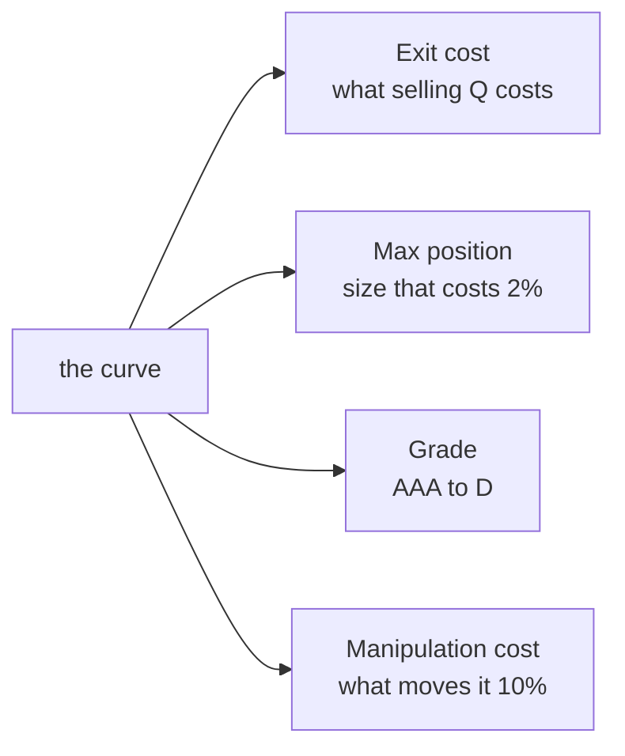

# EXIT — liquidity ratings for crypto

> Market cap tells you what a token **claims** to be worth.
> Exit tells you what you could **actually get**.

**Live: https://exit-henna.vercel.app**

Every price you see in crypto is a quote for the next small trade. It is not a
quote for your position. Exit rates the top 500 tokens by what it would cost you
to sell, and grades them **AAA to D** like a credit rating.

An example from the live site:

> **UNUS SED LEO** — $8.33B market cap. The most you could sell at once for under
> 2% is about **$348k**. On 29 Sep the real order books could not absorb a
> **$100k** sale at all.

---

## How it works



Two things matter in that picture:

1. **Order books are the ground truth.** Every day we download the real books
   from four exchanges, merge them, and walk them at $10k, $100k, $1M and $10M.
   The model is then scored against what actually filled.
2. **The website never calls CoinMarketCap.** Everything is computed once a day
   and saved to SQLite. If CMC goes down, the site keeps working.

---

## The model

One formula. Nothing else on the site is calculated any other way.

```
cost (bps) = 10,000 × Y × σ × (Q / V) ^ δ
```

`Q` is your sale size, `V` is yesterday's 24h volume, `σ` is 30-day volatility.
`Y` and `δ` are fitted to the measured order books.



It starts from the square-root law of market impact (Almgren, Thum, Hauptmann &
Li, 2005). That law is for orders worked slowly over a day. Exit measures selling
**everything right now**, which is harsher, so `δ` is fitted instead of assumed.

---

## How wrong it is

We publish this, because a number without an error bar is a guess.

- Scored only on tokens it never trained on (5-fold cross-validation, grouped by token)
- Typical error: **a factor of about 1.8**
- A learned model had to beat the simple one by 5% to ship. It did not. The simple
  one ships, and the negative result is on the site.
- **Where it is worst:** of the sales no order book could absorb at all, the model
  still priced most of them as cheap. It is too optimistic for thin tokens.

We also ran the model backwards through LUNA, FTT and CRV. **It gave no warning.**
Exit measures the cost of leaving. It does not predict crashes.

---

## CoinMarketCap endpoints used

| Endpoint | Used for | Where |
|---|---|---|
| `/v1/cryptocurrency/listings/latest` | the top 500 token universe | daily run |
| `/v2/cryptocurrency/ohlcv/historical` | daily candles → volume, volatility, market cap | daily run |
| `/v2/cryptocurrency/info` | token names and contracts | setup check |
| `/v4/dex/spot-pairs/latest` | DEX pool coverage check | setup check |
| `/v1/cryptocurrency/market-pairs/latest` | **403 on this plan** — see below | attempted |

Every call is logged — endpoint, status, latency, credits — and the log is a
public page: **[/debug](https://exit-henna.vercel.app/debug)**.

### What the API made possible

Daily OHLCV across 500 tokens is what makes the model possible at all. Volatility
and volume are the only two inputs, and both come from one endpoint. Being able to
pull a consistent 500-token universe meant the ratings cover a real market, not a
handful of cherry-picked tokens.

### Where it got in the way

- **`/v1/cryptocurrency/market-pairs/latest` returns 403** on the hackathon plan.
  That endpoint was the original plan for venue data. We replaced it with public
  exchange order books — which turned out better, because books are measurable
  ground truth and market-pairs is only a listing.
- **Hourly candles only reach back one month**, so older hourly history cannot be
  backfilled after the fact.
- **`/v1/dex/holders/list` returns `500 The system is busy`** even with a key.

---

## Run it yourself

```bash
cp .env.example .env                  # add your CMC key
python -m venv .venv && source .venv/bin/activate
pip install -r requirements.txt

./scripts/daily.sh                    # books → calibrate → rate → export
python -m web.app                     # http://127.0.0.1:5000
pytest -q                             # 45 tests
```

### Ask an AI agent instead

```bash
claude mcp add exit -- $PWD/.venv/bin/python $PWD/exit_mcp.py
```

Then ask: *"Can I get out of $2M of BONK?"*

The MCP server has four tools and answers from the same API the website uses. When
the measured order books contradict the model, it **says so and overrules itself**.

---

## Layout

```
ingest/impact.py       the model — one curve, four readings
ingest/books.py        order-book snapshots (the ground truth)
ingest/calibrate.py    fit the curve, score it, publish the error
ingest/ratings.py      rate every token, once a day
ingest/hindsight.py    run the model backwards through past collapses
web/app.py             6 pages + the public JSON API
exit_mcp.py            MCP server for AI agents
scripts/daily.sh       the whole pipeline, one command
```

## Public API

```bash
curl "https://exit-henna.vercel.app/api/v1/impact/BONK?size=2000000"
curl "https://exit-henna.vercel.app/api/v1/ratings"
```

Every response carries `as_of`, so you always know how old the data is.

---

Data from [CoinMarketCap](https://coinmarketcap.com/api/). Order books from
Binance, OKX, Coinbase and Kraken. Not investment advice.
